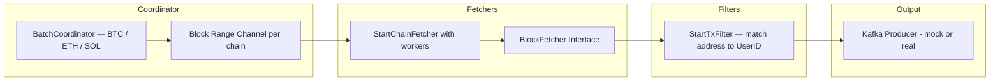

Handling Edge Cases & Reliability

Retry logic
  - Uses SetRetryCount(3) and SetRetryWaitTime(1 * time.Second) from the resty HTTP client
  - Built-in rate limiters inside each Fetcher prevent hitting 429 Too Many Requests

Block Reorganization
  - Each chain fetcher processes blocks sequentially in batches
  - On startup or periodically, the service re-fetches the last N blocks (e.g., 6 for Bitcoin) to handle possible chain reorgs

1h downtime scenario
  - The last processed block height is tracked in memory by the BatchCoordinator
  - In production, this height should be persisted to durable storage such as Redis or PostgreSQL
  - Downstream systems (kafka, db, microservice) should use replication and horizontal scaling to remain available while one instance is down